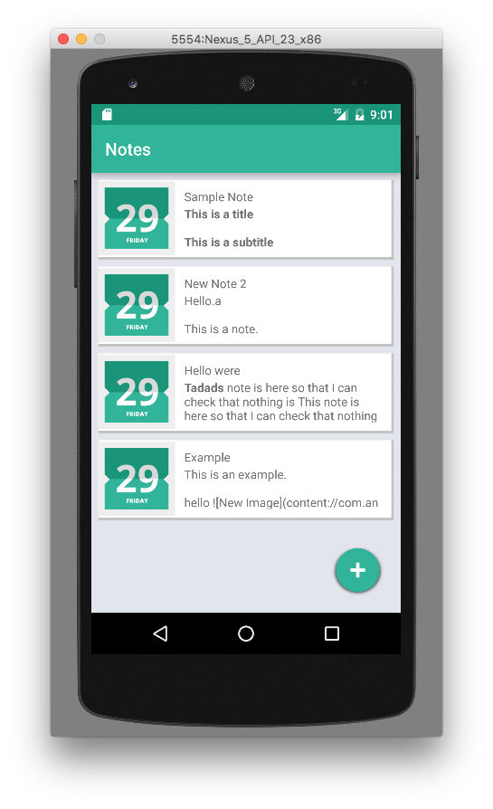
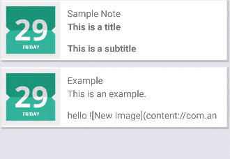
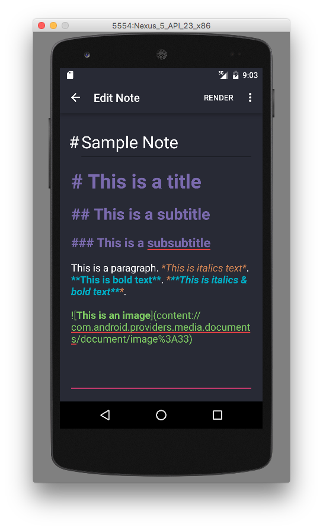
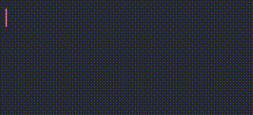
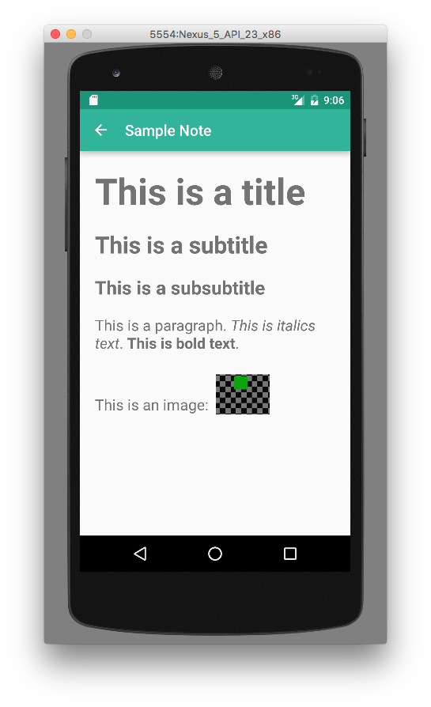
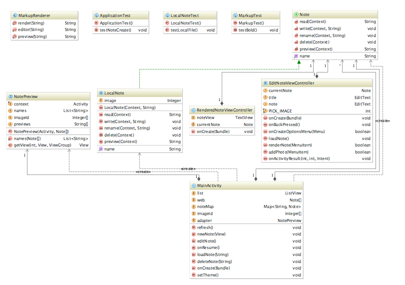
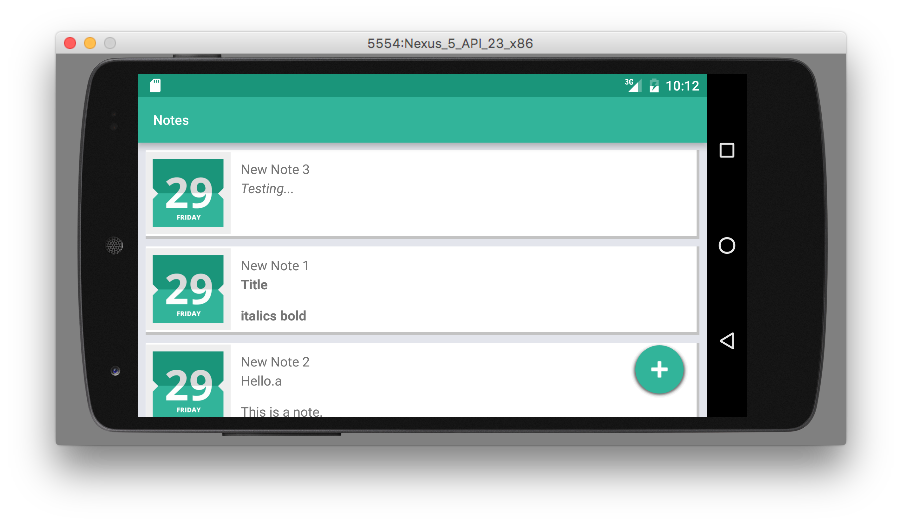
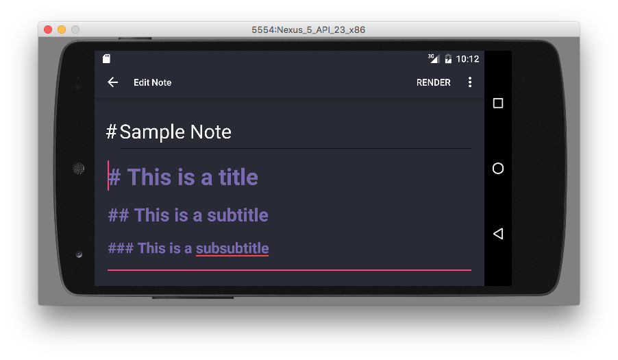
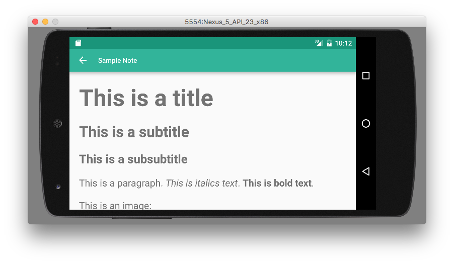

`NotesUp`
=======

`NotesUp` is an Android designed to speed up note-taking on small screens by avoiding graphical formatting buttons, while still providing full rich text features.

As its basic features, it supports the functionality to:

* Create a note note.
* Save the newly created note.
* Open and edit previously saved notes, throughout different sessions.
* Delete saved notes.

In addition to these basic tasks, it supports more advanced features such as 

* *italics* and **bold** formatting
* different sized headers
* images from the Image Gallery
* rendering the note with HTML
* intuitive swipe-based note deletion
* support for both horizontal and vertical display
* a menu for the note editing activity
* previews for each note on the app home screen

Markup
------

The principal feature of the app, NoteUp, is it's method of providing easy formatting. Borrowing features from the markup language, MarkDown, it provides quick ways of adding bold text, italic text, headers and images using only the keyboard and stored in the plain-text. See the User Interface section for a preview of this feature.

NoteUp User Interface
=====================

`NoteUp` is composed of three principal activities: 

* The first, the home page, previews every note and adds functionality for deleting notes and adding notes. Users can open a note by clicking on its preview and delete it by swiping it to the left.

A preview of the note deletion:

* The most important activity is the interface for editing the notes. The text input formats the text as the user types, transforming the input in the same view being used to write the note. This provides immediate feedback and formatting, using only keyboard symbols.

 

A preview of the live-formatting:

* The third section is for previewing notes in a rendered HTML view.

----- 

  

Software Design
===============

The app uses a modification of the *Model-view-controller* design pattern. Because the interaction and the visualisation of notes has to be streamlined together to be intuitive and rapid, the app uses a single class in each activity to encapsulate the view and controller behaviour together.

The design is represented as a UML diagram below:

-----

-----

Notes
-----

Notes are a key component of the app. For the support of future note formats, including external and cloud storage, a `Note` interface is used. The interface provides the functions for basic note tasks, including the creation, editing, reading and deletion of notes. Currently, the only implementation of the interface is the `LocalNote` class, providing notes stored in the local storage. Notes are serialisable.

Markup Renderer
-----------------

The Markup renderer is a simple class for transforming Strings. Using sets of regular expressions for pattern matches and the equivalent replacements, it is easily customisable to add more features.

NotePreview
----------

NotePreview is an ArrayAdapter used for creating previews of each note, displayed on the app's home screen.

Activities
-------

The three activities are `MainActivity`, `EditNoteViewController` and `RenderedNoteViewController`. The three talk to each other by serialising Note objects.

Design Decisions
================

The key decision made during the development of the app was to use a Markdown-like app format. This was chosen due to the wide-spread use of the format in addition to the plain-text only requirement to store the formatting. The ongoing goal of the app is to provide general-use plain-text editing functionality, being able to easily edit external, online or local files and export them again.

Missing Features
================

* The previews currently show a date to their left side. The date is currently a place-holder for when their actual modification date can be shown.

* The images in notes will display in the same session they were added, but currently lose permission in future sessions, until they access the same image from the Media Gallery. This can be fixed by creating local copies of images.

* The Note interface allows for general storage platforms to be added to the app. One of the goals that wasn't achieved in time is to add cloud storage through the use of the Dropbox API and similar products.

Challenges
==========

The biggest challenge of designing and developing `NotesUp` was the lack of experience using the Android platform. Having never owned nor extensively used a phone or tablet running Android meant that I didn't know the capabilities and abilities of Android apps. Inspiration from similar pieces of software is usually a key step in my planning and designing, but a lack of access to the platform meant that this was not possible. However, despite this, throughout the development phase of the app the design was able to be adapted to include newly discovered features and abilities.

Libraries and resources used
============================

* Swipe library: com.daimajia.swipelayout:library:1.2.0@aar
* Calendar icon: http://icons.iconarchive.com/icons/pixelkit/flat-jewels/256/Calendar-icon.png

Testing
=======

Three different techniques were used for the testing of `NotesUp`:

### Unit Testing:

Unit testing was done on each testable component of app, ensuring the each individual functionality works as expected.

The first set of tests was for the key component of the text formatting class, the MarkupTest. It tests that each Regular expression does exactly what it's meant to do, for each of the three different functions.

The next is the the Note interface, and in particular the only implementation, LocalNote. It tests it's creation, editing and deletion.

Each of these tests were added to a pre-commit hook to run every time new code was committed.

### Integration Testing:

I could not manage to get the framework Espresso to work, so the app doesn't have integration testing. As an alternative, monkey testing was used:

### Monkey Testing

Monkey tests are an extremely simple and yet effective method of testing the robustness of apps. Generating thousands of random user interactions allows monkey testing to find bugs. Monkey testing was used in the development of `NotesUp` as a simple (client-side) pre-commit hook script running in the background every time new code was committed, ensuring that every new change was tested against this method.

--------

Landscape
=========

The app fully supports landscape phone displays:

